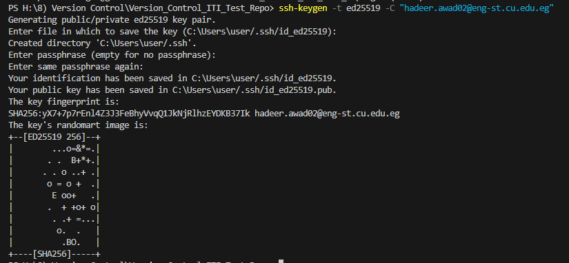
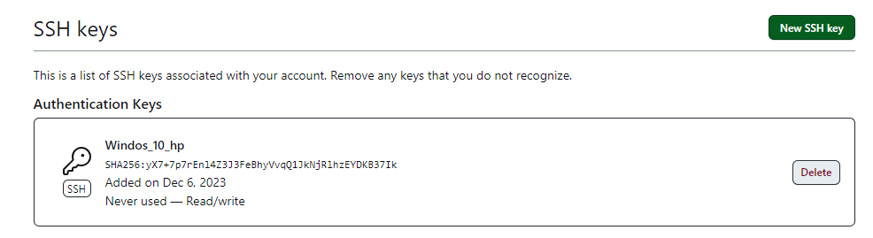
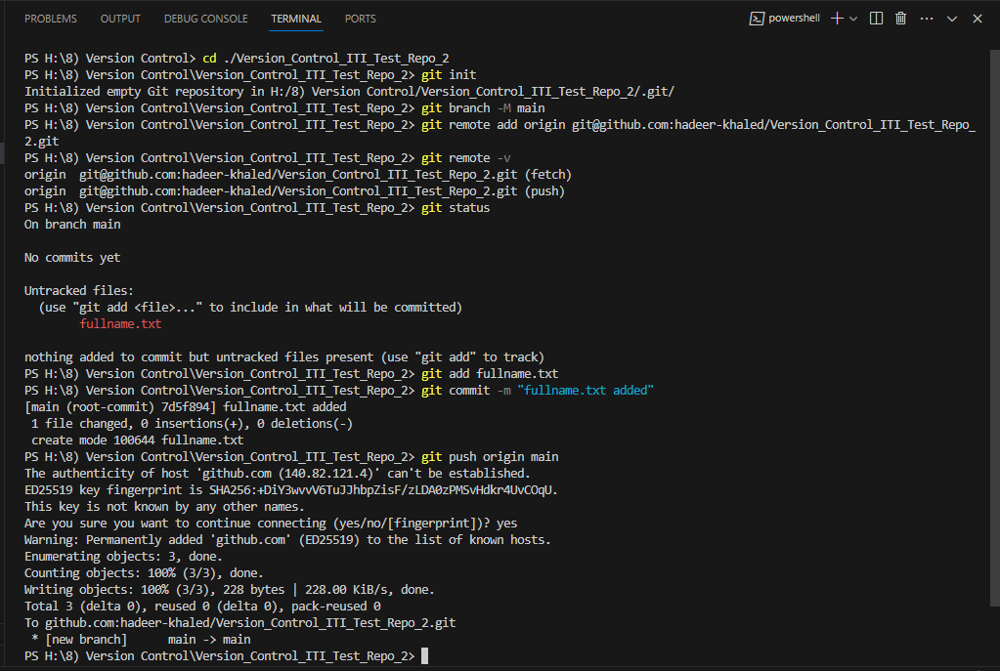
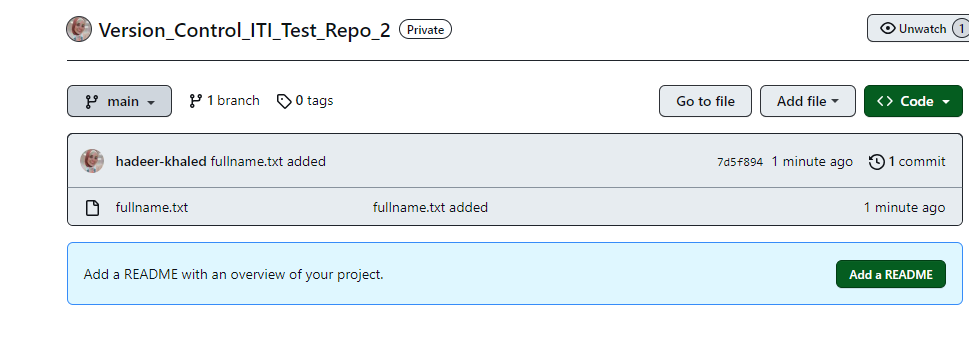
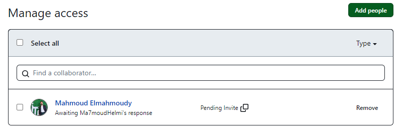

## Q1. Create a SSH key and put the key in GitHub

## Q2. Create a new local repo and a remote repo on GitHub, then make a file contains your full name, then push it to the remote repo, and send an invitation to me.

## Q3. Host your project with github pages

 https://hadeer-khaled.github.io/Version_Control_ITI_Test_Repo_2/